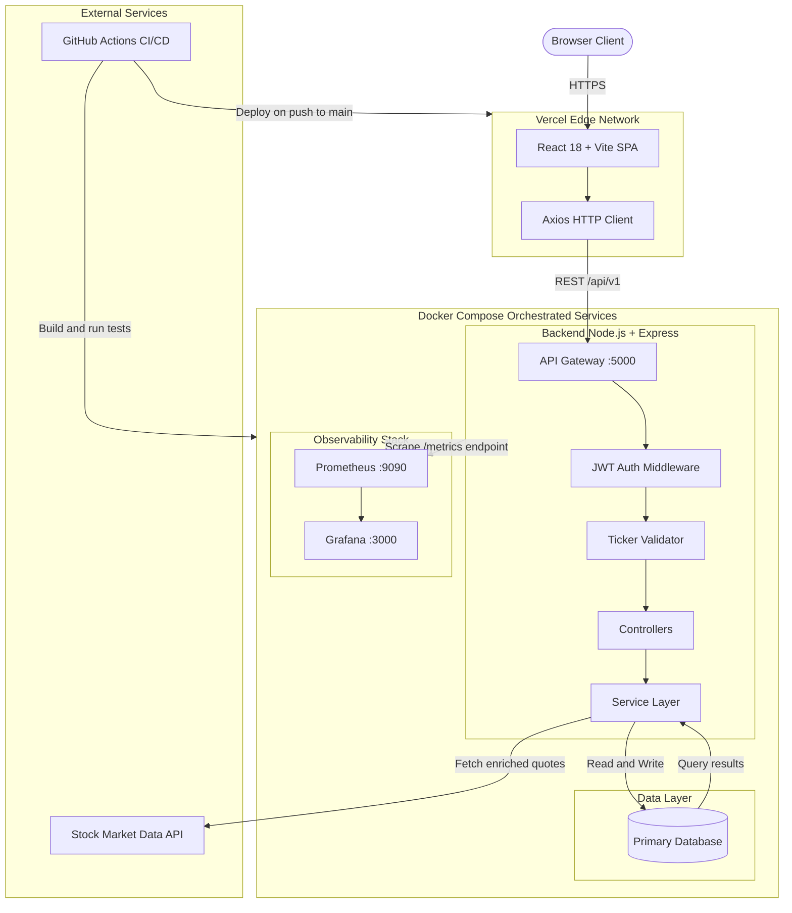
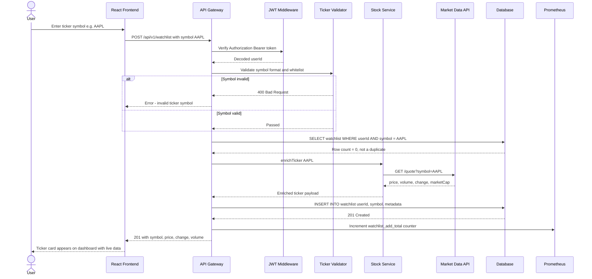
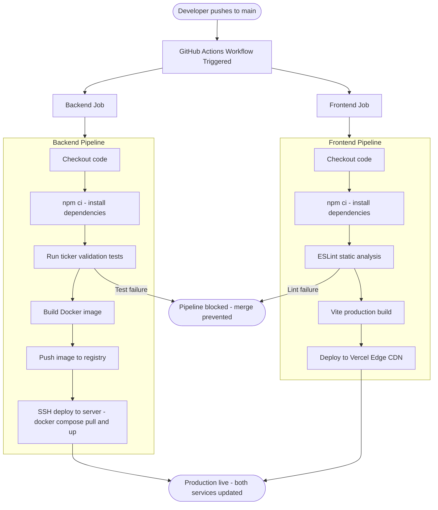

# Vaultlink

> A full-stack financial portfolio and stock tracking platform — built with a production-grade monorepo architecture featuring a dedicated backend API, React frontend, observability stack, Docker-based deployment, and automated CI/CD pipelines.

---

[](LICENSE)
[](/.github/workflows)
[](https://vercel.com)
[](https://grafana.com)
[](docker-compose.yml)

---

## Table of Contents

- [Overview](#overview)
- [System Architecture](#system-architecture)
- [Data Flow](#data-flow)
- [CI/CD Pipeline](#cicd-pipeline)
- [Tech Stack](#tech-stack)
- [Project Structure](#project-structure)
- [Prerequisites](#prerequisites)
- [Environment Configuration](#environment-configuration)
- [Installation](#installation)
- [Running the Application](#running-the-application)
- [Makefile Commands](#makefile-commands)
- [API Reference](#api-reference)
- [Monitoring](#monitoring)
- [Deployment](#deployment)
- [Contributing](#contributing)
- [License](#license)

---

## Overview

Vaultlink is a monorepo platform for tracking financial portfolios, managing stock watchlists, and monitoring asset performance. The system is structured into three independent layers — a Node.js backend API, a React frontend, and a Grafana-based observability stack — each deployable in isolation but orchestrated together via Docker Compose.

Key design decisions:

- **Monorepo structure**: Backend, frontend, and monitoring live in one repository with shared environment configuration, making cross-layer changes atomic and reviewable in a single pull request.
- **Docker Compose for dev and prod**: Separate `docker-compose.yml` and `docker-compose.prod.yml` files allow identical local development environments and reproducible production deployments.
- **Makefile automation**: All common developer workflows (start, stop, build, test, lint) are encoded as `make` targets, eliminating onboarding friction.
- **Ticker validation**: Stock ticker symbols are validated server-side before any external API call, preventing unnecessary third-party quota usage.
- **Grafana observability**: The monitoring stack ships with a pre-configured Grafana dashboard for tracking API latency, error rates, and system health metrics.

---

## System Architecture



---

## Data Flow



---

## CI/CD Pipeline



---

## Tech Stack

### Frontend

| Technology | Purpose |
|---|---|
| React | UI component library |
| Vite | Build tool and dev server |
| Axios | HTTP client for API communication |
| Tailwind CSS | Utility-first styling |

### Backend

| Technology | Purpose |
|---|---|
| Node.js | JavaScript runtime |
| Express | REST API framework |
| JWT | Stateless authentication |
| bcrypt | Password hashing |

### Infrastructure

| Technology | Purpose |
|---|---|
| Docker + Docker Compose | Container orchestration for dev and prod |
| GitHub Actions | CI/CD pipelines |
| Vercel | Frontend hosting and edge deployment |
| Grafana | Observability and metrics dashboards |
| Prometheus | Metrics collection and storage |
| Makefile | Developer workflow automation |

---

## Project Structure

```
Vaultlink/
|
+-- .github/
|   +-- workflows/
|       +-- ci.yml                   # Backend test and build pipeline
|       +-- deploy-frontend.yml      # Vercel frontend deploy pipeline
|
+-- backend/                         # Node.js Express API
|   +-- src/
|   |   +-- controllers/             # Route handlers
|   |   +-- services/                # Business logic + external API calls
|   |   +-- models/                  # Database schemas
|   |   +-- middleware/              # Auth, validation, error handling
|   |   +-- routes/                  # API route definitions
|   |   +-- utils/                   # Ticker validator, helpers
|   +-- tests/                       # Test suite - ticker validation etc.
|   +-- package.json
|
+-- frontend/                        # React + Vite SPA
|   +-- src/
|   |   +-- components/              # Reusable UI components
|   |   +-- pages/                   # Route-level page components
|   |   +-- hooks/                   # Custom React hooks
|   |   +-- services/                # Axios API wrappers
|   |   +-- context/                 # Global state
|   +-- vite.config.js
|   +-- package.json
|
+-- monitoring/                      # Observability stack
|   +-- grafana/
|   |   +-- dashboards/              # Pre-configured Grafana dashboard JSON
|   |   +-- provisioning/            # Grafana datasource config
|   +-- prometheus/
|       +-- prometheus.yml           # Scrape config pointing to backend
|
+-- .env.example                     # Environment variable template
+-- docker-compose.yml               # Development stack
+-- docker-compose.prod.yml          # Production stack
+-- Makefile                         # Developer automation commands
+-- LICENSE
+-- README.md
```

---

## Prerequisites

| Requirement | Version | Notes |
|---|---|---|
| Node.js | v18+ | [nodejs.org](https://nodejs.org/) |
| Docker | Latest | [docker.com](https://www.docker.com/) |
| Docker Compose | v2+ | Bundled with Docker Desktop |
| Make | Any | Pre-installed on Linux/Mac. Windows: use WSL or Chocolatey |

---

## Environment Configuration

```bash
cp .env.example .env
```

```env
# ── Server ────────────────────────────────────────────────────────────────────
PORT=5000
NODE_ENV=development

# ── Database ──────────────────────────────────────────────────────────────────
DATABASE_URL=your_database_connection_string

# ── Authentication ────────────────────────────────────────────────────────────
JWT_SECRET=your-minimum-64-character-secret
JWT_EXPIRES_IN=7d

# ── Stock Market API ──────────────────────────────────────────────────────────
STOCK_API_KEY=your_api_key
STOCK_API_BASE_URL=https://api.yourprovider.com

# ── Frontend ──────────────────────────────────────────────────────────────────
VITE_API_URL=http://localhost:5000

# ── Monitoring ────────────────────────────────────────────────────────────────
GRAFANA_ADMIN_PASSWORD=changeme
```

---

## Installation

```bash
git clone https://github.com/ALTIQUUM/Vaultlink.git
cd Vaultlink
cp .env.example .env
# Edit .env with your credentials
```

---

## Running the Application

### With Docker (Recommended)

```bash
# Development
make dev
# or
docker compose up

# Production
make prod
# or
docker compose -f docker-compose.prod.yml up -d
```

### Without Docker

```bash
# Backend
cd backend && npm install && npm run dev

# Frontend (new terminal)
cd frontend && npm install && npm run dev
```

### Service URLs

| Service | URL |
|---|---|
| Frontend | http://localhost:5173 |
| Backend API | http://localhost:5000 |
| Grafana Dashboard | http://localhost:3000 |
| Prometheus | http://localhost:9090 |

---

## Makefile Commands

```bash
make dev          # Start full development stack via Docker Compose
make prod         # Start production stack
make stop         # Stop all running containers
make build        # Rebuild all Docker images
make test         # Run backend test suite
make lint         # Run ESLint on frontend
make logs         # Tail logs from all containers
make clean        # Remove containers, volumes, and build artifacts
```

---

## API Reference

All endpoints prefixed with `/api/v1`. Protected routes require:

```
Authorization: Bearer <jwt_token>
```

### Authentication

| Method | Endpoint | Auth | Description |
|---|---|---|---|
| `POST` | `/api/v1/auth/register` | No | Create account |
| `POST` | `/api/v1/auth/login` | No | Login, returns JWT |
| `GET` | `/api/v1/auth/me` | Yes | Current user |

### Watchlist

| Method | Endpoint | Auth | Description |
|---|---|---|---|
| `GET` | `/api/v1/watchlist` | Yes | Get user watchlist with live prices |
| `POST` | `/api/v1/watchlist` | Yes | Add ticker to watchlist |
| `DELETE` | `/api/v1/watchlist/:symbol` | Yes | Remove ticker |

### Stocks

| Method | Endpoint | Auth | Description |
|---|---|---|---|
| `GET` | `/api/v1/stocks/:symbol` | Yes | Get current price and metadata |
| `GET` | `/api/v1/stocks/:symbol/history` | Yes | Historical price data |

### Health

| Method | Endpoint | Description |
|---|---|---|
| `GET` | `/api/v1/health` | Server and DB status |

---

## Monitoring

The monitoring stack runs as part of the Docker Compose setup. Grafana is pre-configured with a dashboard covering:

- API request rate and latency (p50, p95, p99)
- Error rate by endpoint
- Database query performance
- Container CPU and memory usage

Access Grafana at `http://localhost:3000` with the credentials set in `GRAFANA_ADMIN_PASSWORD`.

---

## Deployment

### Frontend

The `.github/workflows/deploy-frontend.yml` pipeline automatically deploys the React app to Vercel on every push to `main`. Set the following secrets in your GitHub repository settings:

```
VERCEL_TOKEN
VERCEL_ORG_ID
VERCEL_PROJECT_ID
```

### Backend

Use `docker-compose.prod.yml` on your server:

```bash
docker compose -f docker-compose.prod.yml up -d
```

Pair with Nginx as a reverse proxy for HTTPS termination.

---

## Contributing

1. Branch from `main`:
   ```bash
   git checkout -b feat/your-feature
   ```

2. Follow Conventional Commits:
   ```
   feat(backend): add portfolio performance endpoint
   fix(frontend): correct ticker symbol normalisation
   chore(docker): update compose healthcheck intervals
   ```

3. Ensure tests pass before opening a PR:
   ```bash
   make test
   ```

---

## License

MIT License. See [LICENSE](LICENSE) for details.

---

*ALTIQUUM / Vaultlink — Built in silence. Found in history.*
